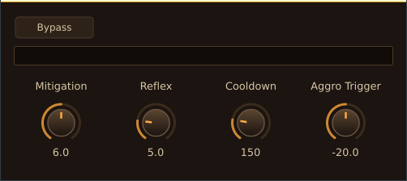

# Tank

A sidechain "pumping" compressor (VST3 / CLAP / Standalone) that ducks a bus — typically bass — whenever a sidechain signal — typically the kick — hits, carving out room in the low end. Fixed-depth trigger ducking in the vein of Kickstart/LFOTool, not a ratio-based compressor.



Think of the kick as the boss and your bass as the tank standing in front of it, taking the hit so the rest of the party — the mids, the vocals — don't get one-shot. Every time the kick swings, your bass needs to pull aggro off it for a moment and eat the damage.

**Aggro Trigger** is how easily the boss notices you — turn it down (toward −40 dB) and even a light tap pulls aggro and triggers a duck; turn it up (toward 0 dB) and only the boss's biggest hits get a reaction. **Reflex** is your reaction time: it's the lookahead, so the tank raises its shield a few milliseconds *before* the hit actually lands instead of flinching after the fact — the shield-up animation is baked into the plugin's reported latency, so your DAW's plugin-delay compensation lines everything back up. **Mitigation** is your armor rating — how much of the hit you actually absorb, from a light graze (0 dB) up to a full block (12 dB). **Cooldown** is how long it takes you to lower your shield and get back to normal after the boss stops swinging (50–500 ms) — and if the boss swings again mid-cooldown, you don't reset to zero, you just keep tanking from wherever your shield currently is, no flinch, no re-aggro stutter. **Bypass** is you dropping aggro and stepping out of the party entirely — the signal walks straight through untouched (still shield-raised/lookahead-delayed under the hood, so nothing jumps when you toggle it).

The GR meter is your health bar, live: watch it dip every time the boss connects, at a smooth ~30 Hz refresh.

| Parameter | APVTS id | Range | Default |
|---|---|---|---|
| Aggro Trigger | `sensitivity` | −40 to 0 dB | −20 dB |
| Reflex | `anticipation` | 1–20 ms | 5 ms |
| Mitigation | `depth` | 0–12 dB | 6 dB |
| Cooldown | `release` | 50–500 ms | 150 ms |
| Bypass | `bypass` | on/off | off |

## Signal flow

```
Sidechain bus (mono)  → 50–150 Hz bandpass → RMS detector → level (dB)
                                                  │
                                                  ▼
                              Ducking envelope (Aggro Trigger / Reflex / Mitigation / Cooldown)
                                                  │
                                                  ▼
Main bus (stereo) → lookahead delay (Reflex) → × gain reduction → Main out (stereo)
```

- **Buses**: stereo Main in, mono Sidechain in, stereo Main out.
- **Detection**: sidechain-only, band-limited to 50–150 Hz (kick fundamental), RMS-based.
- **No sidechain connected** → silence → RMS never crosses the Aggro Trigger threshold → Tank never ducks. No special-case handling needed.
- **Re-trigger before Cooldown finishes** → the envelope ramps from its current reduction level rather than restarting from 0 (no click, no overshoot).

## Repository layout

```
Source/
  PluginProcessor.h/.cpp   — AudioProcessor, APVTS parameter tree, multi-bus setup, DSP wiring, latency reporting
  PluginEditor.h/.cpp      — AudioProcessorEditor: 4 knobs, bypass toggle, GR meter, ~30 Hz UI timer
  DSP/                     — plain (non-JUCE) classes, each independently unit-testable
    BandpassFilter.h       — 2nd-order biquad, fixed 50–150 Hz, sidechain only
    RmsDetector.h          — windowed RMS envelope follower → level in dB
    LookaheadDelay.h        — per-channel circular delay, length = Reflex (anticipation) samples
    DuckingEnvelope.h       — idle → ramp → hold → ramp-back state machine
  UI/
    TankLookAndFeel.h/.cpp — bronze/brown "MMORPG tank" themed LookAndFeel (rotary knobs, labels, toggle)
    TankGrMeter.h          — gain-reduction meter widget
Tests/                     — JUCE-free CTest unit tests (one per DSP class)
scripts/
  install.sh / uninstall.sh — install/remove the packaged release build
docs/
  superpowers/specs/       — design spec
  superpowers/plans/       — implementation plan
  images/tank-editor.png   — screenshot used above
CMakeLists.txt
```

## Building

Prerequisites (Linux): CMake ≥ 3.22, Ninja, and the standard JUCE system deps — see `AudioPlugins/CLAUDE.md` in the workspace root for the full `apt install` line.

```bash
# Configure (first run fetches JUCE 8.0.13 + clap-juce-extensions, ~2 min)
cmake -B build -G Ninja -DCMAKE_BUILD_TYPE=Debug -DCMAKE_EXPORT_COMPILE_COMMANDS=ON

# Build
cmake --build build --parallel

# Run standalone
./build/Tank_artefacts/Debug/Standalone/Tank

# Unit tests
ctest --test-dir build --output-on-failure
```

### Release packaging

```bash
cmake -B build-release -G Ninja -DCMAKE_BUILD_TYPE=Release
cmake --build build-release --parallel
cd build-release && cpack
```

Produces a portable `Tank-<version>-linux-x86_64.tar.gz` with `install.sh` / `uninstall.sh` for installing VST3 + CLAP + Standalone to the user's plugin directories.

## Status

Implemented: DSP chain, APVTS parameters, bronze/brown MMORPG-tank themed editor, GR meter, unit tests, release packaging with install/uninstall scripts.
